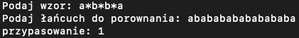
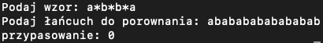

# matchFuncion

Funkcja ustalająca zgodność napisu z wzorcem. 
Znak ’?’ we wzorcu oznacza zgodność z dowolnym innym znakiem. 
Znak ’ * ’ oznacza zgodność z dowolnym, również pustym, ciągiem znaków w łańcuchu. 
Znak różny od ’?’ i ’ * ’ oznacza zgodność tylko z samym sobą
  
Np. match("*.txt", s) moze sprawdzać czy plik o nazwie s jest formatu .txt

Przykładowe użycie:

